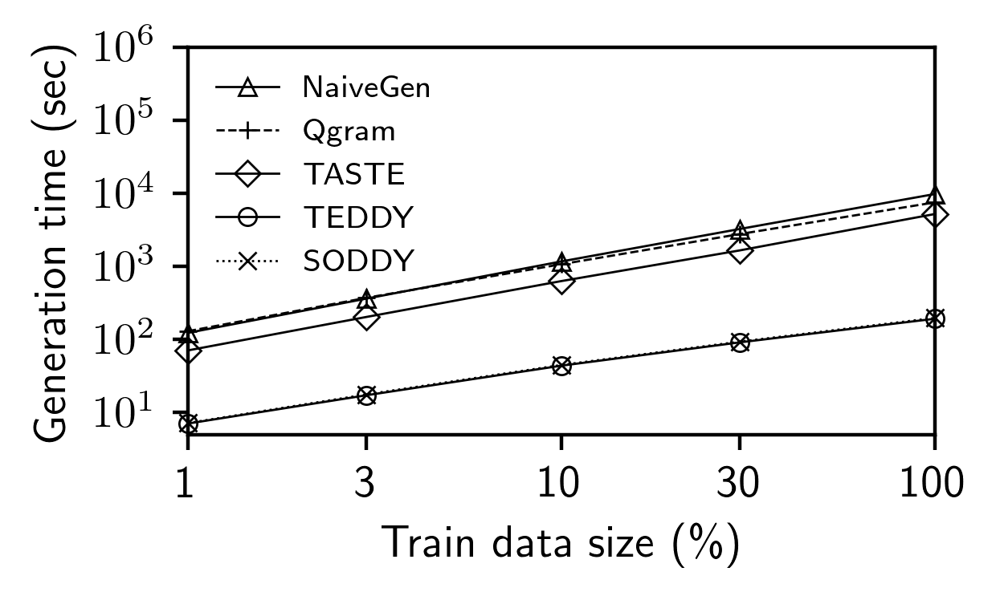

# Plotting Graphs and Tables from the Experimental Results

## Running the example notebook

After conducting the experiments, you can see the graph or the table by using the notebook file [[example.ipynb](example.ipynb)].
The generated graphs and tables will be stored in the folders ```figures/``` and ```htmls/```, respectively.
See [example.ipynb](example.ipynb) file.

For example, you can obtain graphes and tables by using [example.ipynb](example.ipynb) for the DBLP dataset. Note that if you want to see the graphes and tables for other datasets, what you have to do is to assign the value of the variable ```dataNames``` to the name of dataset that you want to use.

### Drawing graphs of execution times to generate the training data

Here are the graphs of execution time versus data size for the ```base``` and ```prefix-aug``` datasets, respectively.

#### Base training data


#### Prefix-aug training data



### Generating the table of estimated errors for cardinality estimations

Here is the table which shows ```q-error``` of estimated cardinalites for the DBLP dataset.

<table border="1" class="dataframe">
  <thead>
    <tr>
      <th></th>
      <th></th>
      <th colspan="5" halign="left">DBLP</th>
    </tr>
    <tr>
      <th></th>
      <th></th>
      <th>Avg.</th>
      <th>50th</th>
      <th>90th</th>
      <th>99th</th>
      <th>Max.</th>
    </tr>
  </thead>
  <tbody>
    <tr>
      <th>Traditional</th>
      <th>LBS</th>
      <td>3.01</td>
      <td>1.32</td>
      <td>6.00</td>
      <td>26.00</td>
      <td>178.22</td>
    </tr>
    <tr>
      <th rowspan="2" valign="top">Base</th>
      <th>CardNet</th>
      <td>3.30</td>
      <td>1.67</td>
      <td>6.00</td>
      <td>24.79</td>
      <td>232.52</td>
    </tr>
    <tr>
      <th>DREAM</th>
      <td>2.87</td>
      <td>1.51</td>
      <td>4.79</td>
      <td>21.15</td>
      <td>291.28</td>
    </tr>
    <tr>
      <th rowspan="3" valign="top">Prefix</th>
      <th>Astrid</th>
      <td>3.13</td>
      <td>1.53</td>
      <td>5.80</td>
      <td>25.89</td>
      <td>204.01</td>
    </tr>
    <tr>
      <th>CardNet</th>
      <td>2.81</td>
      <td>1.43</td>
      <td>5.01</td>
      <td>20.33</td>
      <td>414.15</td>
    </tr>
    <tr>
      <th>DREAM</th>
      <td>2.03</td>
      <td>1.25</td>
      <td>3.27</td>
      <td>12.61</td>
      <td>151.84</td>
    </tr>
  </tbody>
</table>
